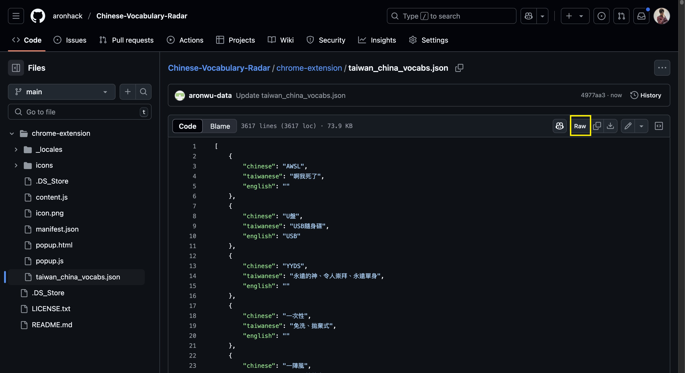
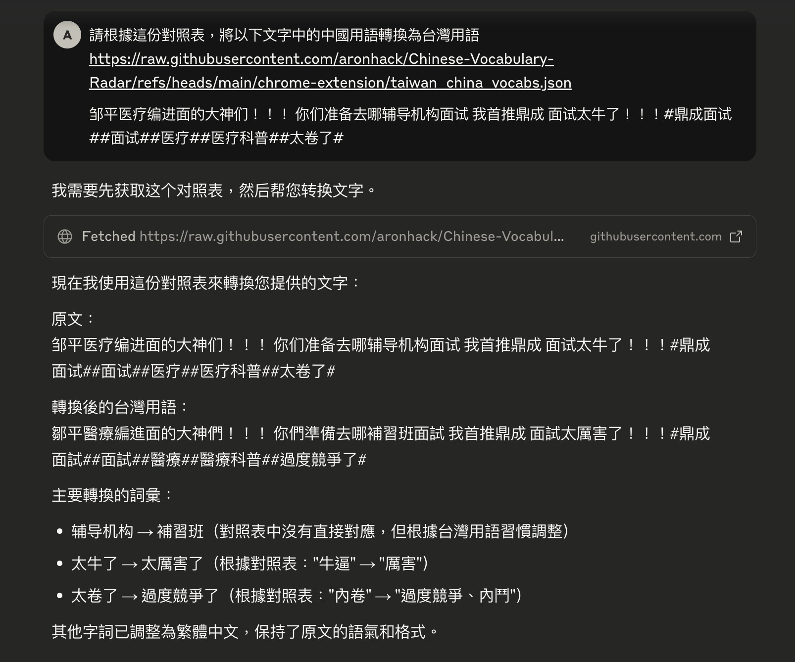

# 中國用語雷達 Chinese Vocabulary Radar

近幾年，中國用語大肆出現在台灣人的日常生活中。雖然語言的融合與混用為正常現象，但帶有政治意涵的文化入侵仍值得關注。

[中國用語雷達 Chinese Vocabulary Radar](https://chromewebstore.google.com/detail/lecgchakaccigfbbaeialhjplbmgipge?utm_source=item-share-cb)是一款Google Chrome擴充功能，可以掃描網頁中的中國用語，並以黃色標示。這個工具的目的是提升台灣民眾對語言使用的敏感度，並非製造衝突與對立，因此，此工具命名為「中國用語雷達」，而不是帶有貶義的「支語雷達」。


## 進階用法 - 搭配AI使用
你可以在chrome-extension的資料夾中找到`taiwan_china_vocabs.json`，這個檔案包含了所有台灣與中國用語的資料。點擊下圖的按鈕就可以取得這個檔案的連結。



接著再將連結提供給AI，請AI根據這份對照表，將以下文字中的中國用語轉換為台灣用語
```
請根據這份對照表，將以下文字中的中國用語轉換為台灣用語 
https://raw.githubusercontent.com/aronhack/Chinese-Vocabulary-Radar/refs/heads/main/chrome-extension/taiwan_china_vocabs.json 

#新说唱晋级标准# 选手们的表现太卷了！有人挑战高难度技巧，有人打造记忆点旋律。这些不同方向的“高光”，在晋级规则里占比如何？
```




## 內容授權
中國用語雷達的原始碼授權為 [MIT](https://github.com/aronhack/Chinese-Vocabulary-Radar/blob/main/LICENSE.txt)，文字段落以 [CC 0 公眾領域](https://creativecommons.org/publicdomain/zero/1.0/deed.zh-hant)釋出，你可以盡情分享、改寫或用作商業用途。

